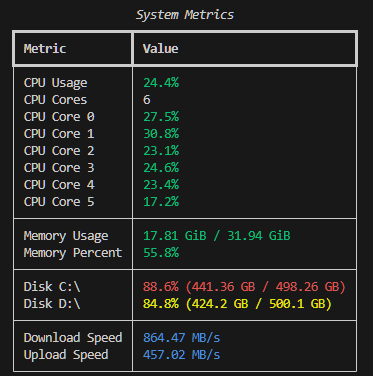
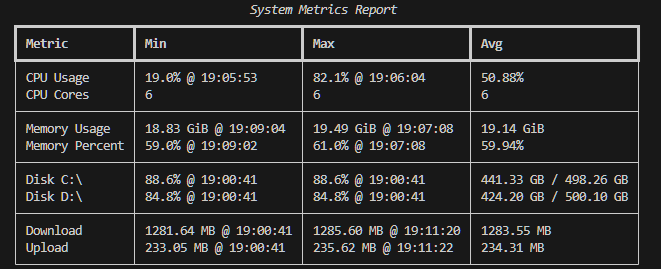

# System Metrics Monitor

A Python tool for collecting, logging, and reporting system metrics (CPU, memory, disk, network) using `psutil` and `rich`.




## Features

- Real-time live display of system metrics in the terminal
- Logging to JSON or CSV formats
- Report generation with min/max/avg stats from log files
- Configurable warning thresholds for CPU and memory

## Installation
```bash
pip install psutil rich
```

## Usage

```
python src/main.py [--log LOG_FILE] [--format FORMAT] [--interval INTERVAL] [--cpu-warn CPU_WARN] [--mem-warn MEM_WARN] [--date DATE]
```

| Argument | Required | Default | Description |
|---|---|---|---|
| `--log` | No | — | Path to the log file |
| `--format` | No | `json` | Log format: `json` or `csv`. ignored if `--log` is provided|
| `--interval` | No | `2` | Seconds between metric collections |
| `--cpu-warn` | No | `85` | CPU usage % at which the display turns red |
| `--mem-warn` | No | `85` | Memory usage % at which the display turns red |
| `--date` | No | — | If provided, show a report for this date (`YYYY-MM-DD`) before the live display |

## Examples

Start live monitoring, logging to CSV:
```base
python src/main.py --format csv
```

Log to a custom JSON path with a custom interval and warning thresholds:
```base
python src/main.py --log metrics.json --interval 5 --cpu-warn 75 --mem-warn 80
```

Show a report for a specific date:
```base
python src/main.py --date 2026-03-16
```

## Log Formats

### JSON

```json
{
  "2026-03-16": {
    "10:00:00": {
      "metrics": {
        "cpu": {
            "total_percent": 50.0,
            "per_core_percent": [
                56.9,
                54.7,
                53.8,
                41.5,
                40.6,
                52.3
            ],
            "core_count": 6
        },
        "memory": {
            "total": 31.94,
            "used": 15.82,
            "available": 16.12,
            "percent": 49.5
        },
        "disks": [
            {
                "device": "C:\\",
                "mountpoint": "C:\\",
                "total": 498.26,
                "used": 442.01,
                "free": 56.25,
                "percent": 88.7
            },
            {
                "device": "D:\\",
                "mountpoint": "D:\\",
                "total": 500.1,
                "used": 424.2,
                "free": 75.91,
                "percent": 84.8
            }
        ],
        "network": {
            "download": 209.38,
            "upload": 17.37
        }
      }
  }
}
```

### CSV

Each row is a timestamped snapshot with flattened columns:

```
timestamp,cpu_total_percent,cpu_core_count,memory_used (GiB),...,disk_0_mount,disk_0_percent,...
2026-03-16T10:00:00,45.2,8,6.1,...,/,60.0,...
```

## Running Tests

```bash
pytest tests/
```